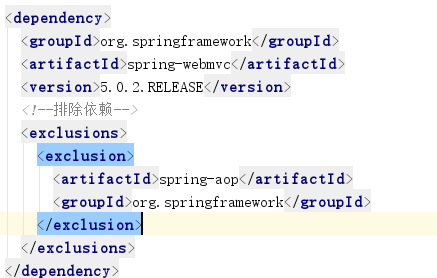

# Maven的第二天

### 一、回顾

```
1. maven的好处
	依赖管理：对jar包的统一管理
	项目构建（一步构建）：对编码完成后的过程标准化，交一个命令来完成
		clean
		compile  test  package install deploy
	适合大型项目的开发：可以把一个大型的项目拆分成多个小的子项目
		
2.三套生命周期
    	清理周期：clean
    	默认周期：compile  test  package install deploy
    	站点周期：site（不用）
    	在同一套生命周期内，执行后面的命令，会自动执行前面所有的命令
3.仓库的分类
    	本地仓库： 本地电脑一个文件夹
    	远程仓库：私服:局域网上的一台电脑
    			中央仓库：maven团队维护的一个仓库    
    				https://repo1.maven.org/maven2/
    				https://mvnrepository.com
4.依赖范围：
    			 	编译 	测试	运行
    	compile: 
    	test
    	provided
    	runtime
```

### 二、教学目标

1. 传递依赖冲突解决
2. 回顾SSM框架
3. 拆分和聚合SSM框架
4. 依赖范围对传递依赖的影响（了解）
5. 私服的下载和搭建(了解)

### 三、传递依赖冲突解决

  1 .maven自带的原则

​	第一声明者优先

​	路径近者优先

2. 排除依赖

   	

   	

3. 锁定版本(推荐使用提取版本号的方法)

   ```
    <!--依赖版本管理器: 管理jar包的版本,不能引入jar包-->
     <dependencyManagement>
         <dependencies>
           <dependency>
             <groupId>org.springframework</groupId>
             <artifactId>spring-webmvc</artifactId>
             <version>5.0.2.RELEASE</version>
           </dependency>
         </dependencies>
     </dependencyManagement>
   ```

   	

### 四、回顾SSM框架

	

### 五、拆分和聚合SSM框架

创建子工程时 注意

	

创建子模块的路径的设置

	

测试的问题

​	在使用junit右键测试时，依赖的项目可以是源码

​	在使用maven的test命令时，依赖的项目必须是一个jar包（会在本地仓库中查找依赖的jar包）

测试service

​	classpath: ---> classpath*

​	把parent添加到本地仓库

### 六、依赖范围对传递依赖的影响(了解)

	

### 七、私服的下载和搭建(了解)

1、下载

​	https://my.sonatype.com/

	

2、 安装

​		

	

3、访问私服

localhost:8081/nexus

	

4.仓库的分类

​	宿主仓库：第三方jar包(oracle)，发行版jar包，测试jar包(公司内部开发的jar包)

​	代理仓库：中央仓库的jar包(缓存)，apache的测试jar包(一般是空的）

​	组仓库：宿主仓库，代理仓库（不包含apache的测试jar包）

​	虚拟仓库：maven1的jar包

5.上传jar包到私服

```
1. 指定账号和密码,maven的settings.xml中配置
	<!-- nexus 的账号和密码 -->
	<server>
      <id>releases</id>
      <username>admin</username>
      <password>admin123</password>
    </server>
	<server>
      <id>snapshots</id>
      <username>admin</username>
      <password>admin123</password>
    </server>
2. 指定上传的位置，在上传的项目的pom文件中配置
<!-- 上传的位置 -->
 <distributionManagement>
  	<repository>
  		<id>releases</id>
	<url>http://localhost:8081/nexus/content/repositories/releases/</url>
  	</repository> 
  	<snapshotRepository>
  		<id>snapshots</id>
	<url>http://localhost:8081/nexus/content/repositories/snapshots/</url>
  	</snapshotRepository> 
  </distributionManagement>

```

6.从私服下载jar包

```
1. 添加下载位置，在maven的settings文件中配置
<!--下载的位置-->
<profile>   
	<!--profile的id-->
   <id>dev</id>   
    <repositories>   
      <repository>  
		<!--仓库id，repositories可以配置多个仓库，保证id不重复-->
        <id>nexus</id>   
		<!--仓库地址，即nexus仓库组的地址-->
        <url>http://localhost:8081/nexus/content/groups/public/</url>   
		<!--是否下载releases构件-->
        <releases>   
          <enabled>true</enabled>   
        </releases>   
		<!--是否下载snapshots构件-->
        <snapshots>   
          <enabled>true</enabled>   
        </snapshots>   
      </repository>   
    </repositories>  
	 <pluginRepositories>  
    	<!-- 插件仓库，maven的运行依赖插件，也需要从私服下载插件 -->
        <pluginRepository>  
        	<!-- 插件仓库的id不允许重复，如果重复后边配置会覆盖前边 -->
            <id>public</id>  
            <name>Public Repositories</name>  
            <url>http://localhost:8081/nexus/content/groups/public/</url>  
        </pluginRepository>  
    </pluginRepositories>  
  </profile>  
2. 选择指定的下载位置
<!---激活下载的地址: 指定使用的模板-->
  <activeProfiles>
    <activeProfile>dev</activeProfile>
  </activeProfiles>
```