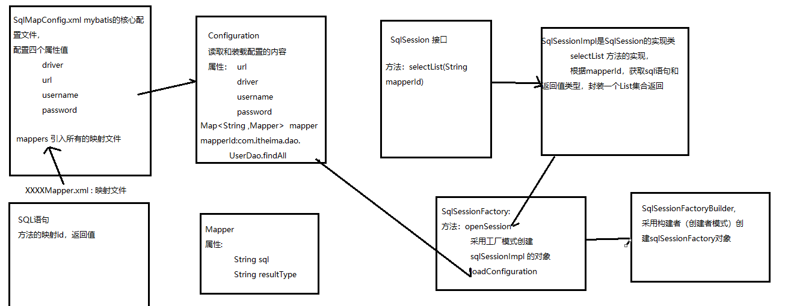

## Mybatis第一天

### 一、回顾

```
1. ajax ： 异步访问
2. servlet : 处理请求和相应  ， 使用在表现层
	filter : 过滤器
	listener ：监听器
3. jsp： 页面展示数据
4. jdbc： 操作数据库  -- 今天用
5. dom4j: 解析xml文件  -- 今天用
6. mysql 数据库
```

### 二、内容介绍

1. 框架的介绍

2. 介绍mybatis框架

3. JDBC于Mybatis框架的比较

4. 自定义Mybatis框架

5. mybatis框架的快速入门


### 三、框架的介绍

##### 1、什么是框架

```
1.  由别定制好的半成品，直接拿过来使用
```

##### 2、框架能解决什么问题

```
1. 把技术给封装起来，写代码时只注重业务逻辑，不用考虑技术的问题
```

##### 3、三层架构中常用的框架

```
1. web 层，表现层
	springMVC , 
	struts2 ,struts1
2. service ： 业务层
	spring
3. dao ： 持久层
	mybatis,非常优秀的持久层框架
	spring data jpa  
	hibernate：慢慢的被取代
springMVC + spring  + mybatis == ssm整合框架  主流
spring全家桶    -- 趋势
```

### 四、mybatis框架的介绍

##### 1.jdbc中的代码

```
		Connection conn = null;
        Statement stm= null;
        ResultSet rs= null;
        try {
            //1. 注册驱动
            Class.forName("com.mysql.jdbc.Driver");
            //2. 获取连接对象Connection
            conn = DriverManager.getConnection("jdbc:mysql://localhost:3306/mybatisdb_63" ,"root", "root");
            //3. 创建statement对象
            stm = conn.createStatement();
            //4. 定义sql语句
            String  sql = "select * from user where username = ? and address= ?";
            //5. 执行sql语句,返回结果街
            rs = stm.executeQuery(sql);
            //6. 处理结果集，封装成pojo对象
            List<User> list = new ArrayList<>();
            while(rs.next()){ //判断结果集中是否有下一条数据
                //每条记录对应一个user对象
                User user = new User();
                //给user赋值
                user.setId(rs.getInt("id"));
                user.setUsername(rs.getString("username"));
                user.setBirthday(rs.getString("birthday"));
                user.setAddress(rs.getString("address"));
                user.setSex(rs.getString("sex"));
                // 把user对象添加到集合中
                list.add(user);
            }


            //看一下结果
            for (User user : list) {
                System.out.println(user.getId());
                System.out.println(user.getUsername());
            }

        } catch (ClassNotFoundException e) {
            e.printStackTrace();
        } catch (SQLException e) {
            e.printStackTrace();
        } finally {
            //关闭资源： 先打开的后关闭
            if(rs!=null){
                try {
                    rs.close();
                } catch (SQLException e) {
                    e.printStackTrace();
                }

            }
            if(stm!=null){
                try {
                    stm.close();
                } catch (SQLException e) {
                    e.printStackTrace();
                }

            }
            if(conn!=null){
                try {
                    conn.close();
                } catch (SQLException e) {
                    e.printStackTrace();
                }

            }
        }
jdbc 中的问题
	优点： 效率高
  	缺点：  1，对数据库的连接对象频繁的创建和销毁
           2， sql语句在java代码中硬编码
           3. 在传参数硬编码
           4. 处理结果集硬编码
```

#####    2. mybatis框架的概述

```
1. ibatis 前身
2. 连接池： 可以解决对数据库的连接对象频繁的创建和销毁
3. 把sql语句写在xml配置文件中, 解决sql语句在java代码中硬编码
4. 采用反射机制处理结果集(难点),解决处理结果集硬编码
```

### 五、自定义框架	

	

### 六、Mybatis框架的快速入门

```
0. 引入jar包
<dependencies>
        <dependency>
            <groupId>org.mybatis</groupId>
            <artifactId>mybatis</artifactId>
            <version>3.4.5</version>
        </dependency>
        <dependency>
            <groupId>mysql</groupId>
            <artifactId>mysql-connector-java</artifactId>
            <version>5.1.6</version>
        </dependency>
        <dependency>
            <groupId>junit</groupId>
            <artifactId>junit</artifactId>
            <version>4.9</version>
        </dependency>
    </dependencies>
1. 引入配置文件
<?xml version="1.0" encoding="UTF-8" ?>
<!DOCTYPE configuration
        PUBLIC "-//mybatis.org//DTD Config 3.0//EN"
        "http://mybatis.org/dtd/mybatis-3-config.dtd">
<configuration>
    <environments default="development">
        <environment id="development">
            <transactionManager type="JDBC" />
            <dataSource type="POOLED">
                <property name="driver" value="com.mysql.jdbc.Driver" />
                <property name="url" value="jdbc:mysql://127.0.0.1:3306/mybatisdb_63?characterEncoding=utf8" />
                <property name="username" value="root" />
                <property name="password" value="root" />
            </dataSource>
        </environment>
    </environments>
	<mappers>
		<mapper resource="com/itheima/mapper/UserMapper.xml"></mapper>
    </mappers>
</configuration>    
2. 引入XXXMapper.xml
<?xml version="1.0" encoding="utf-8" ?>
<!DOCTYPE mapper
        PUBLIC "-//mybatis.org//DTD Mapper 3.0//EN"
        "http://mybatis.org/dtd/mybatis-3-mapper.dtd">
<mapper namespace="com.itheima.mapper.UserMapper">
    <select id="findAll" resultType="com.itheima.domain.User">
        select * from user
    </select>
</mapper>
3. 创建pojo对象
package com.itheima.domain;

public class User {

    private Integer id;
    private String username;
    private String address;
    private String birthday;
    private String sex;

    public Integer getId() {
        return id;
    }

    public void setId(Integer id) {
        this.id = id;
    }

    public String getUsername() {
        return username;
    }

    public void setUsername(String username) {
        this.username = username;
    }

    public String getAddress() {
        return address;
    }

    public void setAddress(String address) {
        this.address = address;
    }

    public String getBirthday() {
        return birthday;
    }

    public void setBirthday(String birthday) {
        this.birthday = birthday;
    }

    public String getSex() {
        return sex;
    }

    public void setSex(String sex) {
        this.sex = sex;
    }
}
4. 测试mybatis框架
package com.itheima.test;

import com.itheima.domain.User;
import org.apache.ibatis.session.SqlSession;
import org.apache.ibatis.session.SqlSessionFactory;
import org.apache.ibatis.session.SqlSessionFactoryBuilder;
import org.junit.Test;

import java.io.InputStream;
import java.util.List;

public class TestMybatis {

    @Test
    public void test(){
        InputStream inputStream = TestMybatis.class.getClassLoader().getResourceAsStream("SqlMapConfig.xml");
        SqlSessionFactory sessionFactory = new SqlSessionFactoryBuilder().build(inputStream);
        SqlSession sqlSession = sessionFactory.openSession();

        List<User> list = sqlSession.selectList("com.itheima.mapper.UserMapper.findAll");
        for (User user : list) {
            System.out.println(user.getId());
            System.out.println(user.getUsername());
        }
    }
}

```


### 七、总结